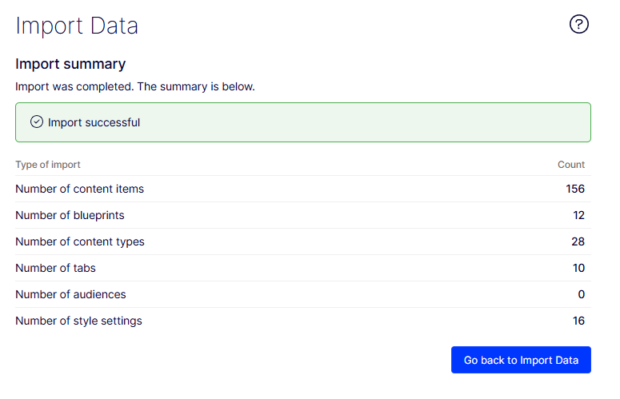

[Back to readme](../README.md)
## Optimizely CMS Configuration <!-- omit in toc -->
These instructions assume that you've just received the e-mail with login information for the CMS and are able to login to the fresh CMS instance.

- [1. Import the content pack](#1-import-the-content-pack)
- [2. Configure the application](#2-configure-the-application)
- [3. Configure the languages](#3-configure-the-languages)
- [4. Update content in Optimizely Graph](#4-update-content-in-optimizely-graph)

### 1. Import the content pack

- Download the [IntialData.episerverdata](../InitialData.episerverdata) file to your local disk, to a place where you can access it.
- Login to the CMS and navigate to "Settings" (cog icon on the left-hand side) - and then go "Import data", under the heading "Tools".
- Import the settings according to the screenshot here

After clicking "Begin Import", you should see a loader during the import. After import, a results section should appear, which summarized the number of imported items.

### 2. Configure the application
With the content now imported, the next step is to do the initial configuraiton of the application. This will allow the website to connect to the content and render it.

- Navigate to "Settings" (cog icon on the left-hand side) - and then go to "Applications" under "Settings"
- Click on "Create Application" to create a new channel definition
- Fill out the form as follows:

| Field | Instruction |
| - | - |
| Application Name | The name for the application, use "Mosey Bank" or a name you've selected yourself
| Choose Start page | Select `From Existing`, and then the start page of the website, that is "Mosey Bank" for the included content pack |

- Now click on "Create Application", you should go back to the list of applications, which now has your just created application.

### 3. Configure the languages
The last step is to have the available languages match the languages in the content pack.

- Navigate to "Settings" (cog icon on the left-hand side) - and then go to "Manage Website Languages" under "Config"
- Using the "triple dot" icon on the left of each item, disable Swedish ("Svenska")

### 4. Update content in Optimizely Graph
To make sure the content upload and configuration changes from the previous steps are reflected in Optimizely Graph, take the following steps:

- Navigate to "Settings" (cog icon on the left-hand side) - and then go to "Scheduled Jobs" under "Scheduled Jobs"
- Click the "Start" button on the item "Optimizely Graph Full Synchronization", the status should change to "Running".
- Once the status returns to "MANUAL" the synchronization process has completed.

The content will now be reflected correctly by Optimizely Graph

[Back to readme](../README.md)