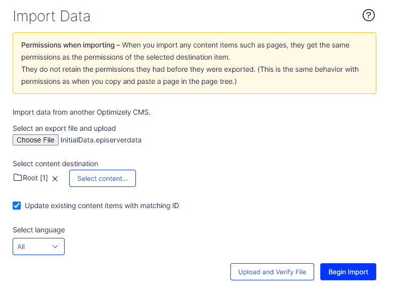
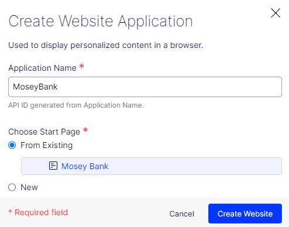
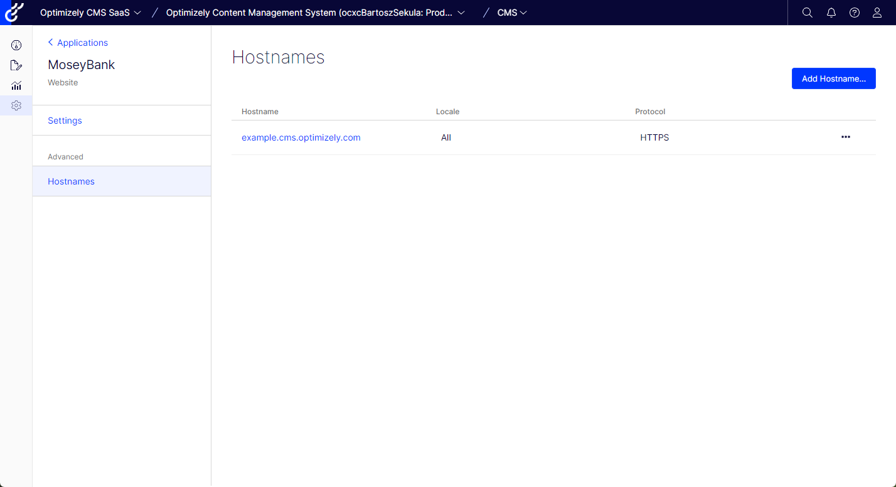
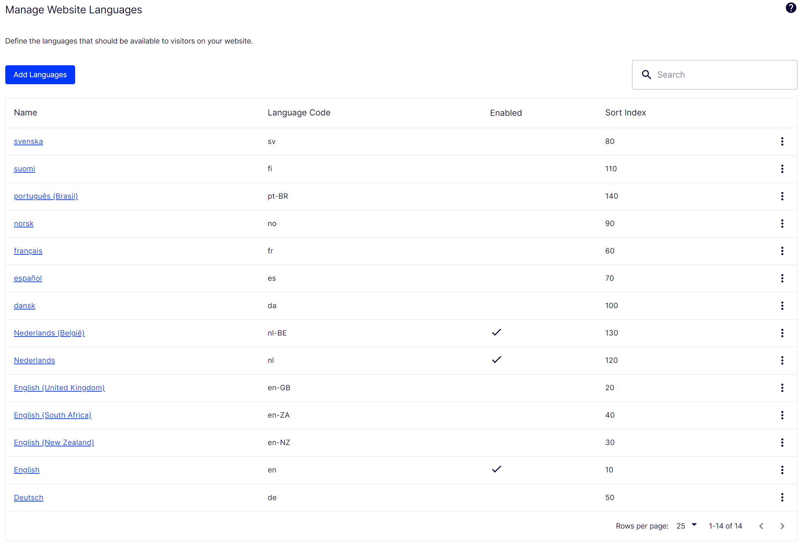

[Back to readme](../README.md)
## Optimizely CMS Configuration <!-- omit in toc -->
These instructions assume that you've just received the e-mail with login information for the CMS and are able to login to the fresh CMS instance.

- [1. Import the content pack](#1-import-the-content-pack)
- [2. Configure the channel](#2-configure-the-channel)
- [3. Configure the languages](#3-configure-the-languages)
- [4. Update content in Optimizely Graph](#4-update-content-in-optimizely-graph)
- [5. Update the Header/Footer configuration](#5-update-the-headerfooter-configuration)

### 1. Import the content pack

- Download the [IntialData.episerverdata](../InitialData.episerverdata) file to your local disk, to a place where you can access it.
- Login to the CMS and navigate to "Settings" (cog icon on the left-hand side) - and then go "Import data", under the heading "Tools".
- Import the settings according to the screenshot here

After clicking "Begin Import", you should see a loader during the import. After import, a results section should appear, which summarized the number of imported items.

### 2. Configure the channel
With the content now imported, the next step is to do the initial configuraiton of the channel. This will allow the website to connect to the content and render it.

- Navigate to "Settings" (cog icon on the left-hand side) - and then go to "Manage Websites" under "Config"
- Click on "Create website" to create a new channel definition
- Fill out the form as follows:

| Field | Instruction |
| - | - |
| Name | The name for the channel, use "Mosey Bank" or a name you've selected yourself
| URL | Copy the URL from your browser and remove everything after the domain. So `https://example.cms.optimizely.com/ui/EPIServer.Cms.UI/...` becomes `https://example.cms.optimizely.com/` |
| Start page | Select the start page of the channel, that is "Mosey Bank" for the included content pack |
| Use site-specific assets | Checking this option will allow you to store assets at a channel level. |

- Now click on "Create website", you should go back to the list of sites.
- Click on the ***Name*** of the website you've just created, you should now see same form again, with the settings you've just created **and** the first host defined.
- Click on the "Add Host" button and create the following settings:

| Field | Instruction |
| - | - |
| Host Name | Put in a single asterisk (*) |
| Type | Keep this field empty |
| Culture | Keep this field empty |
| Scheme | Keep this field empty |

- Click on "Add Host" to add this host to the list
- Click on "Save Website" to update the website definition

### 3. Configure the languages
The last step is to have the available languages match the languages in the content pack.

- Navigate to "Settings" (cog icon on the left-hand side) - and then go to "Manage Website Languages" under "Config"
- Using the "triple dot" icon on the left of each item, disable Swedish ("Svenska") and enable Dutch ("Nederlands") and Flemish ("Nederlands (België)")

After configuration the list should look like:

### 4. Update content in Optimizely Graph
To make sure the content upload and configuration changes from the previous steps are reflected in Optimizely Graph, take the following steps:

- Navigate to "Settings" (cog icon on the left-hand side) - and then go to "Scheduled Jobs" under "Scheduled Jobs"
- Filter the job-list for "Graph" and click the "Optimizely Graph content synchronization job"
- Click the "Start" button on the "Details" page that has just been opened, the status should change to "Running", with status updates next to it.
- Once the status returns to "IDLE" the synchronization process has completed.

The content will now be reflected correctly by Optimizely Graph

### 5. Update the Header/Footer configuration
The header and footer are referenced by the identifier of the website/channel, this identifier will only be created in step 2 above. These steps ensure the header & footer configuration can be found by the frontend:

1. **Obtain the channel identifier:**
    - Navigate to "Settings" (cog icon on the left-hand side) - and then go to "Manage Websites" under "Config"
    - Click on the ***Name*** of the website you've created as part of step 2 above
    - Copy the value of the "ID" field (Which looks like: xxxxxxxx-xxxx-xxxx-xxxx-xxxxxxxxxxxx)

2. **Make the "Multi-Channel Content" visible:**
    - Navigate to "Edit" (page with pen icon on the left-hand side)
    - Open the "Navigation pane" (tree icon, left-hand side, near the top of the page) and pin it (pin icon at the right top of the opened pane)
    - Click the "Settings" icon of the "Navigation pane" (right top, left of "pin") and click "Add Gadgets"
    - Search for "Multi" and click "Multi-Channel Content"
    - Scroll within the "Navigation pane" to make the "Multi-Channel Content" visible

3. **Apply the configuration:**
    - Within the "Multi-Channel Content", navigate to `Content` > `Channel configuration` > `Web`
    - Click on `Website Footer`; switch to "All properties" (bullet-list icon at the right top of the screen)
    - Go to the "Settings" tab
    - Paste identifier copied above, into the Channel ID field.
    - At the right top a marker for the changed content should appear, next to the "Publish?" menu, open the menu and click "Publish changes"
    - Within the "Omni-Channel Content", click `Website Header`
    - Go to the "Settings" tab
    - Paste identifier copied above, into the Channel ID field.
    - At the right top a marker for the changed content should appear, next to the "Publish?" menu, open the menu and click "Publish changes"

[Back to readme](../README.md)